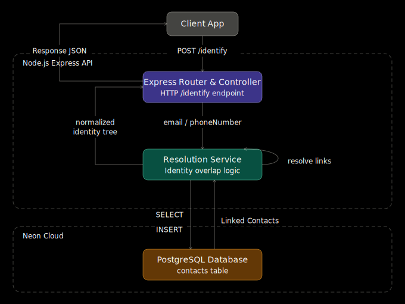

# Contact Identity Resolution Engine

This project is a backend API for resolving duplicate customer identities across email and phone records. It accepts partial contact inputs, links related records, promotes a canonical primary contact when needed, and returns a consolidated identity view that downstream systems can use safely.

## Architecture



## Problem It Solves

Customer data often arrives from multiple forms, devices, or workflows with overlapping phone numbers and email addresses. This service merges those records into a single logical identity while preserving the relationship between primary and secondary contacts.

## Capabilities

- Accepts either `email`, `phoneNumber`, or both
- Finds related contacts through shared identifiers
- Merges overlapping records into a single identity graph
- Maintains primary and secondary contact precedence
- Returns a normalized view of:
  - canonical contact id
  - all known emails
  - all known phone numbers
  - secondary contact ids

## API

### `POST /identify`

Request:

```json
{
  "email": "foo@example.com",
  "phoneNumber": "1234567890"
}
```

Response:

```json
{
  "contact": {
    "primaryContatctId": 1,
    "emails": ["foo@example.com"],
    "phoneNumbers": ["1234567890"],
    "secondaryContactIds": [2, 3]
  }
}
```

## Tech Stack

- Node.js
- TypeScript
- Express
- PostgreSQL / Neon
- dotenv

## Project Structure

```text
src/
├── controllers
├── routes
├── services
├── database
├── models
├── app.ts
└── server.ts
```

## Local Development

Install dependencies:

```bash
npm install
```

Create a `.env` file:

```env
DATABASE_URL=your_neon_postgres_url
PORT=3000
```

Run in development:

```bash
npm run dev
```

Build and run production:

```bash
npm run build
npm start
```

## Data Model

The service stores contacts with:

- `email`
- `phoneNumber`
- `linkedId`
- `linkPrecedence`
- timestamps

This model allows the service to keep a canonical primary record while linking duplicate or later-discovered records as secondaries.

## Why This Project Matters

This is not just a CRUD API. The interesting part is the identity-resolution logic:

- discovering overlap across partially matching inputs
- merging previously separate identity chains
- maintaining a stable canonical record
- returning a deterministic consolidated response

That makes it a solid backend systems project focused on data consistency and business rules, not just transport and routing.
